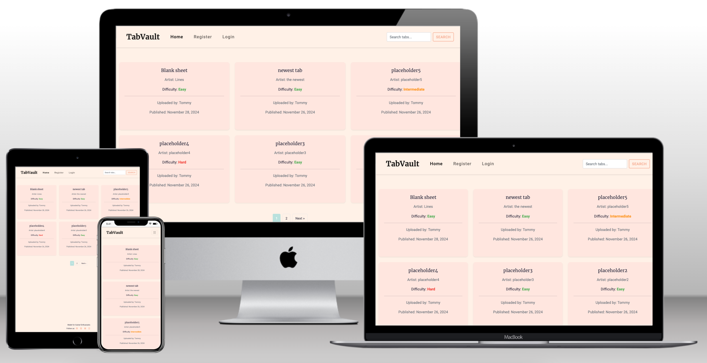
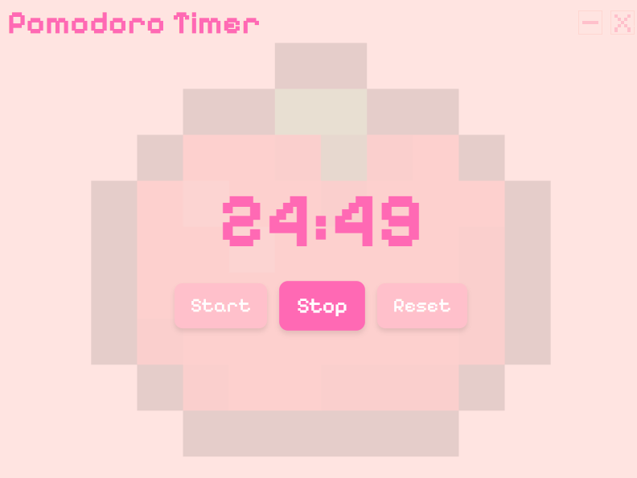
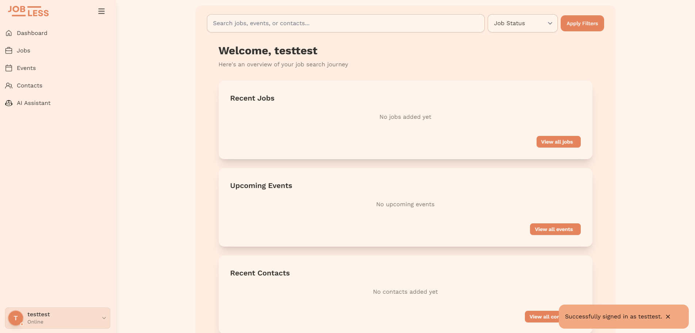

<h1 align="center">Hi, I'm Tommy</h1>
<h3 align="center">A passionate junior full stack developer from Cornwall </h3>
<h4 align="center">Scroll down to see my projects!</h4>

 

<h3 align="left">Languages and Tools:</h3>

 </a>       <a href="https://www.python.org" target="_blank" rel="noreferrer">     <a href="https://heroku.com" target="_blank" rel="noreferrer">     

&nbsp;

 

# TabVault

## A Full Stack Web Application

TabVault is an online platform designed to help creators organize, store, and manage their guitar tabs. The platform allows users to bookmark tabs for easy access and manage them through a secure dashboard. 

<a href="https://github.com/Oliver-Tommy/TabVault">View Repository</a>

 

# Pomodoro Timer App

## Productivity Web Application

A sleek and intuitive Pomodoro timer application designed to boost productivity using the time-tested Pomodoro Technique. Features customizable work and break intervals, visual progress tracking, and a clean, distraction-free interface.

<a href="https://github.com/Oliver-Tommy/Pomodoro-app">View Repository</a>

<be>

# Jobless

## Job Tracking Web Application

A comprehensive job application tracking system designed to help job seekers organize their applications, track interview schedules, and manage their career search efficiently. Features include application status tracking, interview preparation tools, and progress analytics.

<a href="https://jobless-339d5aae65c9.herokuapp.com/ai-assistant/">View Website</a>

<a href="https://github.com/katepz/Jobless">View Repository</a>

<be>

# Chromatic Tuner

## Music Utility Web Application

A precision chromatic tuner application for musicians. Built with advanced audio processing capabilities, this tool provides accurate pitch detection for all instruments with a responsive and user-friendly interface.

<a href="https://github.com/Oliver-Tommy/chrom-tuner">View Repository</a>

<be>

# MindGuide

## Front End Web Application

A website built to provide accessible information on mental health.

<a href="https://oliver-tommy.github.io/Mental-Health-Awareness/">View Website</a>

  

<h3 align="left">Connect with me:</h3>

